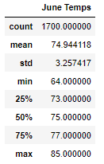
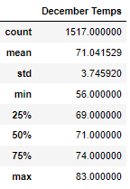
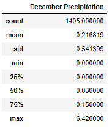

# surfs_up

## Surf's Up Analysis Overview:

### W. Avy has asked to do some additional analysis from what has already been delivered; 
He wanted to take a closer look at June and December information about temperature trends before opening the surf shop. Specifically, he wants temperature data for the months of June and December in Oahu, in order to determine if the surf and ice cream shop business is sustainable year-round.

## Surf's Up Results:

### There was interesting information that was gathered that may need some further analysis to fully understand:

1) When you look at June vs December mean temperature, it isn't such a large difference, only about 3 degrees.  But this doesn't seem to b!e a measure of the day to day changes in temp and those seasons:

2) In looking at the minimum vs the maximum temperatures we can see a bit more revealing information;
The minimum temp in June is 64 F while in Dec it is a chilly 56! We would need to see about wetsuits for those chillier days.
The maximum temp doesn't show such a wide difference in temperature at 86 for June and 83 for December.

3) Another interesting statistic is the 25%, 50% and 75% temperature differences. This leads us back to point 1 with the 4 degree difference, which isn't so bad. This makes me wonder about the other statistics for weather that make a big difference, rain!

## PH Analysis Summary:
The actual temperature differences between June and December are surprisingly not so vast as they may be in for example Chicago! But another important element to temperature is percipitation.

Two additional queries were run to show the rain for the same months of June and December

In looking at this output we can note the following:

1) 

### Bobby ran a few different queries to further the analysis as an introduction as to what needs to be looked at:
Using the SQL for creating the mentorship_eligibilty.csv which was filtering on 1965, Bobby ran the same for 1952, 1953, and 1954;

1) Bobby knows there is an underlying question: How many roles will need to be filled as the "silver tsunami" begins to make an impact?

To answer this, Bobby refactored the SQL he used for the 1965 group and changed the range from January 1st of 1952 through December 31st of 1955, and came up with this number of employees who will be elible for retirement and the number was 72,458 as shown in below output:

2) The above information has made senior management concerned if there are there enough qualified, retirement-ready employees in the departments to mentor the next generation of Pewlett Hackard employees?

By looking at difference in the retirement eligible vs those not eligible, there does seem to be a chance to take advantage of the large number of employees who have years of experience at PH and train and mentor the younger employees.  Bobby thinks the 1965 age is too low and perhaps a more aggressive mentorship program could be started for those in the immediate range of Jan 1, 1952 through Dec 31, 1955. 

#### Resources
- current_emp.csv
- emp_info.csv
- manager_info

- Software: PostgreSQL

# Challenge Overview
There were definitely parts of the challenge that were not clear which resulted in me wasting time on irrelevent points. Otherwise, it was a fun challenge - like a puzzle you are both creating and solving at the same time.
